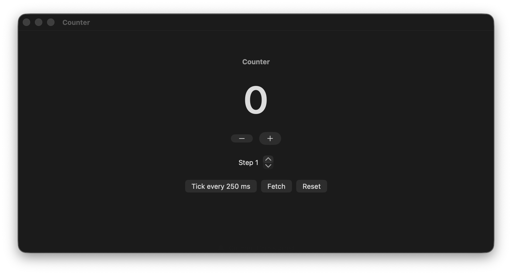
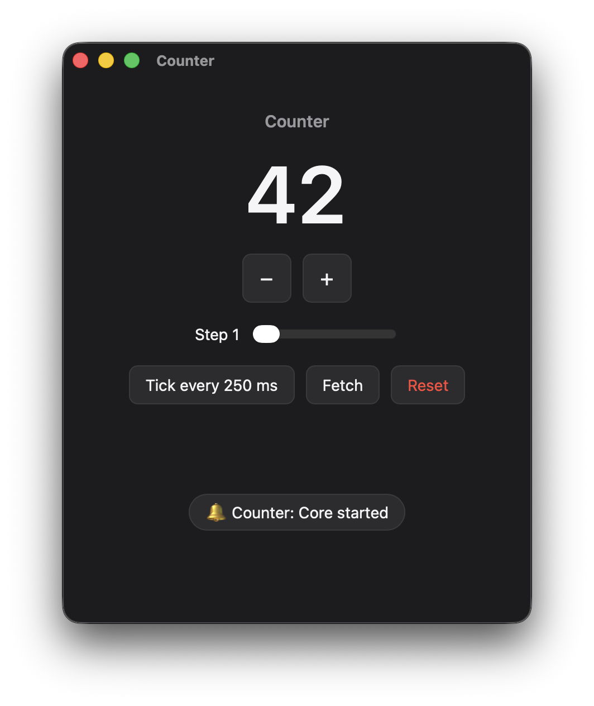

# Carapace

**Write your app's brain once in Rust. Give each platform a thin, generated shell.**

A Mac app should look and behave like a Mac app. A Rust core is faster to get
right, and it runs everywhere. Carapace joins the two: your logic lives in one
Rust crate, and SwiftUI, Tauri/TypeScript, Node/Electron or anything that can
call C drives it through one small, stable C ABI. Typed Swift and TypeScript
bindings are generated from the core's JSON Schema, so shells stay thin and
cannot drift from the core.

<p>
  
  
</p>

The same Rust core, rendered by SwiftUI and by a webview. [Good Night](https://github.com/michael-berardi/goodnight)
runs its macOS and Windows apps on one Carapace engine.

## What you get

- **One core, many shells.** State, actions, timers, background work and
  platform requests are written once in Rust.
- **Native on Apple platforms.** `CarapaceKit` gives SwiftUI an `ObservableObject`
  store with `send`, `sendSync` (applies the result inside `withAnimation`),
  bindings, and pure `query` calls. No bindings layer to learn.
- **Web and desktop everywhere else.** A Tauri 2 plugin and a TypeScript client
  (React hooks included) run the same core on Windows, Linux and macOS. Node and
  Electron main processes load it through the C ABI.
- **Generated, checked bindings.** `cargo carapace gen` writes Swift and
  TypeScript types from the core. A schema fingerprint is checked at start-up, so
  stale bindings fail with a message that names the fix.
- **Testable logic.** The core is a deterministic engine: `dispatch(action)` returns the new
  state, events and requested effects. Write plain `#[test]`s, with no UI and no mocks.
- **Debuggable by design.** Undecodable actions, panics in `update`, and send
  cycles become faults with the app name and the offending input. Nothing fails silently.

## Quick start

```rust
use carapace::{App, Cx, NoEvent};
use schemars::JsonSchema;
use serde::{Deserialize, Serialize};

#[derive(Default, Serialize, Deserialize, JsonSchema)]
pub struct Config {}

#[derive(Serialize, JsonSchema)]
pub struct State { pub count: i64 }

#[derive(Clone, Serialize, Deserialize, JsonSchema)]
#[serde(tag = "type", rename_all = "camelCase")]
pub enum Action { Increment, Reset }

pub struct Counter(i64);

impl App for Counter {
    type State = State;
    type Action = Action;
    type Event = NoEvent;
    type Config = Config;
    const NAME: &'static str = "Counter";

    fn init(_: Config, _: &mut Cx<Self>) -> Self { Counter(0) }
    fn update(&mut self, action: Action, _: &mut Cx<Self>) {
        match action { Action::Increment => self.0 += 1, Action::Reset => self.0 = 0 }
    }
    fn state(&self) -> State { State { count: self.0 } }
}

carapace::export!(Counter);
```

```toml
[lib]
crate-type = ["lib", "staticlib", "cdylib"]
```

Install the tool, generate bindings and package the core:

```sh
cargo install --git https://github.com/michael-berardi/carapace cargo-carapace
cargo carapace gen swift --out Sources/App          # Counter.swift
cargo carapace gen ts --out web/src/generated       # Counter.ts
cargo carapace build apple --out apple/Core         # universal xcframework
```

SwiftUI:

```swift
import CarapaceFFI
import CarapaceKit
import SwiftUI

@main struct CounterApp: App {
    @StateObject private var store = try! CounterStore(backend: RustBackend())
    var body: some Scene {
        WindowGroup {
            Button("\(store.state.count)") { store.send(.increment) }
        }
    }
}
```

Tauri (Rust side, then React):

```rust
tauri::Builder::default()
    .plugin(tauri_plugin_carapace::plugin::<Counter, _>(Default::default()))
```

```tsx
const store = await Store.connect<Types>(tauriTransport(), { schemaHash });
const { count } = useCarapace(store);
<button onClick={() => store.dispatch(actions.increment())}>{count}</button>
```

Full walk-throughs: [Getting started](docs/getting-started.md).

## Shells

| Shell | Status in 0.1.0 |
|---|---|
| SwiftUI on macOS (13+) | Tested: `swift test` against the real core, plus a running example app. |
| SwiftUI on iOS | `cargo carapace build apple --ios` produces the device and simulator slices (checked). `CarapaceKit` itself has not been compiled for iOS yet: no iOS SDK on the build machine. |
| Tauri 2 (webview) | Tested on macOS with a running example. Windows and Linux use the same code and have not been run. |
| Node, and Electron's main process | Tested in Node with the real core through `koffi`. Not yet run inside Electron. |
| Python (`ctypes`) | Tested: `tests/abi/test_abi.py` drives every ABI function. |
| Flutter, Qt, Kotlin, C#, Go | Anything that can call C can use the [ABI](docs/architecture.md#the-c-abi). No generators or samples yet. |

[Choosing a shell](docs/choosing-a-shell.md) compares these with Electron, Flutter, React Native and Qt.

## How it works

```
 SwiftUI / webview / Node / ...                Rust
┌──────────────────────────────┐   JSON    ┌──────────────────────────────┐
│ render state                 │ ◄──────── │ State  (snapshot per change) │
│ send actions                 │ ────────► │ Action → update(&mut self)   │
│ handle events (notify, open) │ ◄──────── │ Event  (platform requests)   │
│ call pure queries            │ ◄───────► │ Query → Answer (stateless)   │
└──────────────────────────────┘           └──────────────────────────────┘
        generated types                 one actor thread, timers, background work
```

State travels as JSON snapshots, one per change, coalesced on the shell side.
That keeps the ABI to twelve functions and makes every shell trivial. Measured on
an M-series Mac, the core-side cost per action is 5 µs for a tiny state, 53 µs
at 1,000 rows (49 KB) and 0.44 ms at 10,000 rows (514 KB). Keep `State` shaped
like the view, and window long lists.
[Architecture](docs/architecture.md) has the details and the limits.

## Repository

| Path | What |
|---|---|
| `crates/carapace` | The runtime, the C ABI and the `export!` macro. |
| `crates/carapace-codegen` | JSON Schema to Swift and TypeScript. |
| `crates/carapace-cli` | `cargo carapace`: `gen`, `schema`, `build apple`, `doctor`. |
| `crates/tauri-plugin-carapace` | Tauri 2 plugin that hosts a core. |
| `Sources/` | `CarapaceKit` and `CarapaceFFI` (Swift package, product names `CarapaceKit`, `CarapaceFFI`). |
| `packages/client` | `@carapace/client`: store, Tauri and Node transports, React hooks. |
| `examples/counter` | One core, three shells: SwiftUI, Tauri + React, Node tests. |
| `tests/abi` | Language-neutral ABI test in Python. |

Add the Swift package with
`.package(url: "https://github.com/michael-berardi/carapace", from: "0.1.0")`.

## Develop

```sh
scripts/test-all.sh      # Rust, Swift, TypeScript and ABI tests, plus the example app builds
```

[Contributing](CONTRIBUTING.md) · [Security](SECURITY.md) · [Changelog](CHANGELOG.md) · MIT
